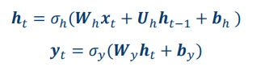
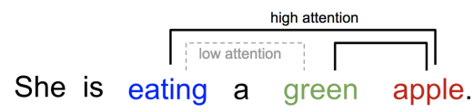
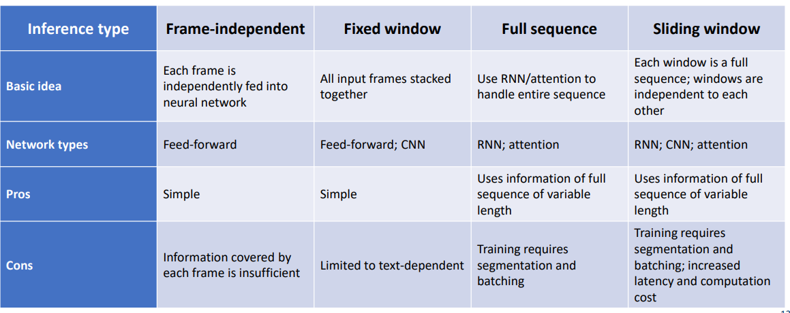
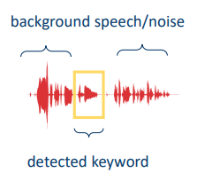
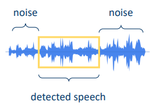

## RNN vs CNN

Comparison:

 • CNN reuses parameters in the space dimension – same kernel, every location 

• RNN reuses parameters in the time dimension – same parameters, every time step

Long short-term memory (LSTM) 

• Problems with vanilla RNN: 

• It’s difficult to retain memory for a long time 

 It has the vanishing gradient problem 

• Long short-term memory (LSTM) was proposed to address these problem 

• An LSTM unit is composed of:

• A cell 

• An input gate 

• An output gate 

• A forget gate

Long short-term memory (LSTM) 

• The core idea: 

• Cell states: carry over memory information 

• Input gate: let input affect the memory

 • Output gate: let memory affect output

 • Forget gate: throw away the memory

 • With the forget gate, we can learn to forget

Given an input sequence

 • RNN produces an output for each input 

• The output sequence has the same length as the input sequence

 • For speaker recognition: 

• We need a single embedding

Detection perturbation

 • Which part of audio do we feed an speaker recognition input? 

• Text-dependent: keyword/wakeword detection 

• Text-independent: voice activity detection (VAD)

